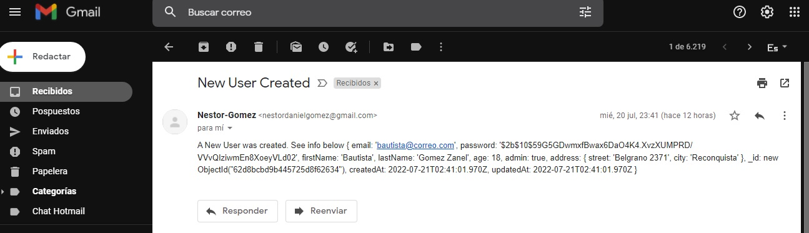
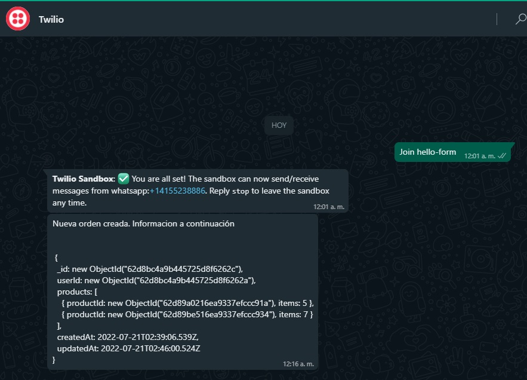

# Proyecto: 3era Entrega Proyecto Final

## Autor: Néstor Gómez

## Curso: Backend by CODERHOUSE

> ```
> Indicaciones: Generar un archivo .env con las variables de entorno, luego npm install.
> ```

# 📁 Collection: Marcas

## End-point: localhost:5000/api/brands

Post de Marcas de bebidas

### Method: POST

> ```
> localhost:5000/api/brands
> ```

### Body (**raw**)

```json
{ "name": "Maria Codorniu" }
```

⁃ ⁃ ⁃ ⁃ ⁃ ⁃ ⁃ ⁃ ⁃ ⁃ ⁃ ⁃ ⁃ ⁃ ⁃ ⁃ ⁃ ⁃ ⁃ ⁃ ⁃ ⁃ ⁃ ⁃ ⁃ ⁃ ⁃ ⁃ ⁃ ⁃ ⁃ ⁃ ⁃ ⁃ ⁃ ⁃ ⁃ ⁃ ⁃ ⁃ ⁃ ⁃ ⁃ ⁃ ⁃ ⁃ ⁃

## End-point: localhost:5000/api/brands

Get de Marcas

### Method: GET

> ```
> localhost:5000/api/brands
> ```

### Body (**raw**)

```json
{ "name": "Septima Obra" }
```

⁃ ⁃ ⁃ ⁃ ⁃ ⁃ ⁃ ⁃ ⁃ ⁃ ⁃ ⁃ ⁃ ⁃ ⁃ ⁃ ⁃ ⁃ ⁃ ⁃ ⁃ ⁃ ⁃ ⁃ ⁃ ⁃ ⁃ ⁃ ⁃ ⁃ ⁃ ⁃ ⁃ ⁃ ⁃ ⁃ ⁃ ⁃ ⁃ ⁃ ⁃ ⁃ ⁃ ⁃ ⁃ ⁃ ⁃

## End-point: localhost:5000/api/brands

Borrar una marca

### Method: DELETE

> ```
> localhost:5000/api/brands/62d89ac416ea9337efccc927
> ```

### Body (**raw**)

```json
{ "name": "Trumpeter 2" }
```

⁃ ⁃ ⁃ ⁃ ⁃ ⁃ ⁃ ⁃ ⁃ ⁃ ⁃ ⁃ ⁃ ⁃ ⁃ ⁃ ⁃ ⁃ ⁃ ⁃ ⁃ ⁃ ⁃ ⁃ ⁃ ⁃ ⁃ ⁃ ⁃ ⁃ ⁃ ⁃ ⁃ ⁃ ⁃ ⁃ ⁃ ⁃ ⁃ ⁃ ⁃ ⁃ ⁃ ⁃ ⁃ ⁃ ⁃

# 📁 Collection: Categorias

## End-point: localhost:5000/api/categories/62d878feef3617aa3ede6ff0

Actualizar Categoria

### Method: PUT

> ```
> localhost:5000/api/categories/62d878feef3617aa3ede6ff0
> ```

### Body (**raw**)

```json
{ "name": "importado" }
```

⁃ ⁃ ⁃ ⁃ ⁃ ⁃ ⁃ ⁃ ⁃ ⁃ ⁃ ⁃ ⁃ ⁃ ⁃ ⁃ ⁃ ⁃ ⁃ ⁃ ⁃ ⁃ ⁃ ⁃ ⁃ ⁃ ⁃ ⁃ ⁃ ⁃ ⁃ ⁃ ⁃ ⁃ ⁃ ⁃ ⁃ ⁃ ⁃ ⁃ ⁃ ⁃ ⁃ ⁃ ⁃ ⁃ ⁃

## End-point: localhost:5000/api/categories

Post de Categorias

### Method: GET

> ```
> localhost:5000/api/categories
> ```

### Body (**raw**)

```json
{ "name": "Vinos" }
```

⁃ ⁃ ⁃ ⁃ ⁃ ⁃ ⁃ ⁃ ⁃ ⁃ ⁃ ⁃ ⁃ ⁃ ⁃ ⁃ ⁃ ⁃ ⁃ ⁃ ⁃ ⁃ ⁃ ⁃ ⁃ ⁃ ⁃ ⁃ ⁃ ⁃ ⁃ ⁃ ⁃ ⁃ ⁃ ⁃ ⁃ ⁃ ⁃ ⁃ ⁃ ⁃ ⁃ ⁃ ⁃ ⁃ ⁃

## End-point: localhost:5000/api/categories

Post de caterogias

### Method: POST

> ```
> localhost:5000/api/categories
> ```

### Body (**raw**)

```json
{ "name": "Whisky" }
```

⁃ ⁃ ⁃ ⁃ ⁃ ⁃ ⁃ ⁃ ⁃ ⁃ ⁃ ⁃ ⁃ ⁃ ⁃ ⁃ ⁃ ⁃ ⁃ ⁃ ⁃ ⁃ ⁃ ⁃ ⁃ ⁃ ⁃ ⁃ ⁃ ⁃ ⁃ ⁃ ⁃ ⁃ ⁃ ⁃ ⁃ ⁃ ⁃ ⁃ ⁃ ⁃ ⁃ ⁃ ⁃ ⁃ ⁃

# 📁 Collection: Varietales

## End-point: localhost:5000/api/varietals

### Method: POST

> ```
> localhost:5000/api/varietals
> ```

### Body (**raw**)

```json
{ "name": "Tinto" }
```

⁃ ⁃ ⁃ ⁃ ⁃ ⁃ ⁃ ⁃ ⁃ ⁃ ⁃ ⁃ ⁃ ⁃ ⁃ ⁃ ⁃ ⁃ ⁃ ⁃ ⁃ ⁃ ⁃ ⁃ ⁃ ⁃ ⁃ ⁃ ⁃ ⁃ ⁃ ⁃ ⁃ ⁃ ⁃ ⁃ ⁃ ⁃ ⁃ ⁃ ⁃ ⁃ ⁃ ⁃ ⁃ ⁃ ⁃

## End-point: localhost:5000/api/varietals

Get de varietales

### Method: GET

> ```
> localhost:5000/api/varietals
> ```

⁃ ⁃ ⁃ ⁃ ⁃ ⁃ ⁃ ⁃ ⁃ ⁃ ⁃ ⁃ ⁃ ⁃ ⁃ ⁃ ⁃ ⁃ ⁃ ⁃ ⁃ ⁃ ⁃ ⁃ ⁃ ⁃ ⁃ ⁃ ⁃ ⁃ ⁃ ⁃ ⁃ ⁃ ⁃ ⁃ ⁃ ⁃ ⁃ ⁃ ⁃ ⁃ ⁃ ⁃ ⁃ ⁃ ⁃

## End-point: localhost:5000/api/varietals

Borrar Varietal por Id

### Method: DELETE

> ```
> localhost:5000/api/varietals/62d8876b564d27d42c3b86f0
> ```

⁃ ⁃ ⁃ ⁃ ⁃ ⁃ ⁃ ⁃ ⁃ ⁃ ⁃ ⁃ ⁃ ⁃ ⁃ ⁃ ⁃ ⁃ ⁃ ⁃ ⁃ ⁃ ⁃ ⁃ ⁃ ⁃ ⁃ ⁃ ⁃ ⁃ ⁃ ⁃ ⁃ ⁃ ⁃ ⁃ ⁃ ⁃ ⁃ ⁃ ⁃ ⁃ ⁃ ⁃ ⁃ ⁃ ⁃

# 📁 Collection: Productos

## End-point: localhost:5000/api/products

Post de un producto

### Method: POST

> ```
> localhost:5000/api/products
> ```

### Body (**raw**)

```json
{
  "name": "Champagne",
  "description": "Botella 750ml",
  "img": "./images/vinos/champagne-mariacodorniu-extrabrut.jpg",
  "price": 2250,
  "stock": 50,
  "categoryId": "62d898bedcf905485d42ed1b",
  "varietalId": "62d89b4416ea9337efccc92e",
  "brandId": "62d89bc316ea9337efccc932"
}
```

### Response: undefined

```json
null
```

⁃ ⁃ ⁃ ⁃ ⁃ ⁃ ⁃ ⁃ ⁃ ⁃ ⁃ ⁃ ⁃ ⁃ ⁃ ⁃ ⁃ ⁃ ⁃ ⁃ ⁃ ⁃ ⁃ ⁃ ⁃ ⁃ ⁃ ⁃ ⁃ ⁃ ⁃ ⁃ ⁃ ⁃ ⁃ ⁃ ⁃ ⁃ ⁃ ⁃ ⁃ ⁃ ⁃ ⁃ ⁃ ⁃ ⁃

## End-point: localhost:5000/api/products

Listar todos los productos

### Method: GET

> ```
> localhost:5000/api/products
> ```

### Body (**raw**)

```json
{
  "email": "nestordanielgomez@gmail.com",
  "password": "nestordanielgomez",
  "firstName": "Nestor",
  "lastName": "Gomez",
  "age": 40,
  "admin": true,
  "address": {
    "street": "Belgrano 2371",
    "city": "Reconquista"
  }
}
```

⁃ ⁃ ⁃ ⁃ ⁃ ⁃ ⁃ ⁃ ⁃ ⁃ ⁃ ⁃ ⁃ ⁃ ⁃ ⁃ ⁃ ⁃ ⁃ ⁃ ⁃ ⁃ ⁃ ⁃ ⁃ ⁃ ⁃ ⁃ ⁃ ⁃ ⁃ ⁃ ⁃ ⁃ ⁃ ⁃ ⁃ ⁃ ⁃ ⁃ ⁃ ⁃ ⁃ ⁃ ⁃ ⁃ ⁃

# 📁 Collection: Usuarios

## End-point: localhost:5000/api/auth/signup

Crear Usuario


### Method: POST

> ```
> localhost:5000/api/auth/signup
> ```

### Body (**raw**)

```json
{
  "email": "bautista@correo.com",
  "password": "bautista",
  "firstName": "Bautista",
  "lastName": "Gomez Zanel",
  "age": 18,
  "admin": true,
  "address": {
    "street": "Belgrano 2371",
    "city": "Reconquista"
  }
}
```

⁃ ⁃ ⁃ ⁃ ⁃ ⁃ ⁃ ⁃ ⁃ ⁃ ⁃ ⁃ ⁃ ⁃ ⁃ ⁃ ⁃ ⁃ ⁃ ⁃ ⁃ ⁃ ⁃ ⁃ ⁃ ⁃ ⁃ ⁃ ⁃ ⁃ ⁃ ⁃ ⁃ ⁃ ⁃ ⁃ ⁃ ⁃ ⁃ ⁃ ⁃ ⁃ ⁃ ⁃ ⁃ ⁃ ⁃

## End-point: localhost:5000/api/auth/login

Login del ususario ya creado previamente

### Method: POST

> ```
> localhost:5000/api/auth/login
> ```

### Body (**raw**)

```json
{
  "email": "leticiazanel@correo.com",
  "password": "leticiazanel"
}
```

⁃ ⁃ ⁃ ⁃ ⁃ ⁃ ⁃ ⁃ ⁃ ⁃ ⁃ ⁃ ⁃ ⁃ ⁃ ⁃ ⁃ ⁃ ⁃ ⁃ ⁃ ⁃ ⁃ ⁃ ⁃ ⁃ ⁃ ⁃ ⁃ ⁃ ⁃ ⁃ ⁃ ⁃ ⁃ ⁃ ⁃ ⁃ ⁃ ⁃ ⁃ ⁃ ⁃ ⁃ ⁃ ⁃ ⁃

## End-point: localhost:5000/api/auth/logout

Desloguearse

### Method: POST

> ```
> localhost:5000/api/auth/logout
> ```

### Body (**raw**)

```json
{
  "email": "leticiazanel@correo.com",
  "password": "leticiazanel",
  "firstName": "Leticia",
  "lastName": "Zanel",
  "age": 39,
  "admin": false,
  "address": {
    "street": "Belgrano 2371",
    "city": "Reconquista"
  }
}
```

⁃ ⁃ ⁃ ⁃ ⁃ ⁃ ⁃ ⁃ ⁃ ⁃ ⁃ ⁃ ⁃ ⁃ ⁃ ⁃ ⁃ ⁃ ⁃ ⁃ ⁃ ⁃ ⁃ ⁃ ⁃ ⁃ ⁃ ⁃ ⁃ ⁃ ⁃ ⁃ ⁃ ⁃ ⁃ ⁃ ⁃ ⁃ ⁃ ⁃ ⁃ ⁃ ⁃ ⁃ ⁃ ⁃ ⁃

# 📁 Collection: Carritos

Cuando se crea un usario se crea el carrito de dicho usuario

## End-point: localhost:5000/api/cart

### Method: GET

> ```
> localhost:5000/api/cart
> ```

### Body (**raw**)

```json
{
  "productId": "62d89a0216ea9337efccc91a",
  "amount": 5
}
```

⁃ ⁃ ⁃ ⁃ ⁃ ⁃ ⁃ ⁃ ⁃ ⁃ ⁃ ⁃ ⁃ ⁃ ⁃ ⁃ ⁃ ⁃ ⁃ ⁃ ⁃ ⁃ ⁃ ⁃ ⁃ ⁃ ⁃ ⁃ ⁃ ⁃ ⁃ ⁃ ⁃ ⁃ ⁃ ⁃ ⁃ ⁃ ⁃ ⁃ ⁃ ⁃ ⁃ ⁃ ⁃ ⁃ ⁃

## End-point: localhost:5000/api/cart/add

Agrego un producto al carrito

### Method: POST

> ```
> localhost:5000/api/cart/add
> ```

### Body (**raw**)

```json
{
  "productId": "62d89be516ea9337efccc934",
  "amount": 7
}
```

⁃ ⁃ ⁃ ⁃ ⁃ ⁃ ⁃ ⁃ ⁃ ⁃ ⁃ ⁃ ⁃ ⁃ ⁃ ⁃ ⁃ ⁃ ⁃ ⁃ ⁃ ⁃ ⁃ ⁃ ⁃ ⁃ ⁃ ⁃ ⁃ ⁃ ⁃ ⁃ ⁃ ⁃ ⁃ ⁃ ⁃ ⁃ ⁃ ⁃ ⁃ ⁃ ⁃ ⁃ ⁃ ⁃ ⁃

## End-point: localhost:5000/api/cart/order

Crear orden de compra


### Method: POST

> ```
> localhost:5000/api/cart/order
> ```

### Body (**raw**)

```json
{
  "productId": "62d89a0216ea9337efccc91a",
  "amount": 5
}
```

⁃ ⁃ ⁃ ⁃ ⁃ ⁃ ⁃ ⁃ ⁃ ⁃ ⁃ ⁃ ⁃ ⁃ ⁃ ⁃ ⁃ ⁃ ⁃ ⁃ ⁃ ⁃ ⁃ ⁃ ⁃ ⁃ ⁃ ⁃ ⁃ ⁃ ⁃ ⁃ ⁃ ⁃ ⁃ ⁃ ⁃ ⁃ ⁃ ⁃ ⁃ ⁃ ⁃ ⁃ ⁃ ⁃ ⁃

---

Powered By: [postman-to-markdown](https://github.com/bautistaj/postman-to-markdown/)
